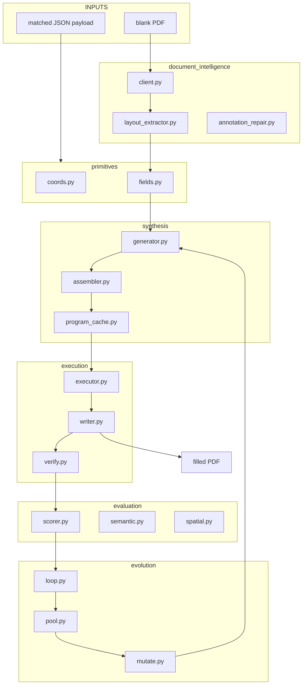

# Project Graph
## Agent Orientation Map — HPE-AFF (post Phase 2)

Fast orientation reference. Read `AGENTS.md` first for constraints and build rules,
then use this file for the concrete layout, module ownership, and call chains.

---

## 1. Repo Topology

```
HPE-AFF/
├── README.md                     orientation + quickstart
├── AGENTS.md                     system design, constraints, build order
│
├── archive/prototype_v0/         original monolith — do not edit
│   ├── core_logic.py             prototype engine (decomposed into Phase 2 modules)
│   ├── app.py                    prototype Streamlit UI
│   ├── intelligent_router.py
│   ├── run_experiment.py / run_hybrid_system.py
│   └── generate_test_forms.py    fixture generator (prototype era)
│
├── primitives/                   shared type layer
│   ├── coords.py                 BoundingBox, Point, page geometry
│   ├── fields.py                 FieldSpec, FieldType enum
│   ├── transforms.py             coord normalisation helpers
│   └── visual.py                 debug rendering
│
├── document_intelligence/        Azure DI integration
│   ├── client.py                 AzureDIClient wrapper
│   ├── layout_extractor.py       page → FieldSpec list
│   ├── annotation_repair.py      fix malformed AcroForm annotations via DI
│   ├── prebuilt.py               prebuilt model calls
│   └── content_understanding.py  Azure Content Understanding helpers
│
├── evaluation/                   scoring
│   ├── scorer.py                 aggregate score, EvaluationResult
│   ├── semantic.py               semantic match checks
│   ├── spatial.py                bounding-box overlap checks
│   ├── structural.py             form-structure validation
│   ├── format_check.py           date/phone/checkbox format rules
│   └── dataset.py                EvalDataset loader
│
├── evolution/                    HPE loop
│   ├── loop.py                   EvolutionLoop orchestrator
│   ├── candidate.py              Candidate dataclass
│   ├── pool.py                   CandidatePool (elite set)
│   └── mutate.py                 mutation operators
│
├── synthesis/                    program generator
│   ├── generator.py              LLM call → PF draft
│   ├── assembler.py              PF → executable program
│   └── program_cache.py          form-family → cached PF
│
├── execution/                    fill + verify
│   ├── executor.py               run PF against PDF
│   ├── writer.py                 AcroForm write-back
│   └── verify.py                 post-fill sanity checks
│
├── tests/
│   ├── test_primitives.py
│   ├── test_evaluation.py
│   ├── test_evolution.py
│   ├── test_execution.py
│   └── test_di_integration.py
│
├── docs/
│   ├── PROJECT_GRAPH.md          this file
│   ├── baseline_results.json     Phase 1 — 71.02% mean field accuracy
│   └── evolution_results.json    Phase 2 — 94.87% mean, 6/10 converged ≥92%
│
├── app.py                        Streamlit UI v2 (uses modular packages)
├── env_config.py                 shared .env loading
├── run_phase1_baseline.py        reproduce Phase 1 measurement (self-contained, no archive dep)
└── run_phase2_evolution.py       run HPE evolution loop
```

---

## 2. Architecture: current (Phase 2)



---

## 3. Module ownership

| Need to change... | Edit here | Depends on |
|---|---|---|
| Coord / field types | `primitives/` | nothing |
| Azure DI calls | `document_intelligence/client.py` | `primitives/` |
| Field extraction from DI response | `document_intelligence/layout_extractor.py` | `primitives/`, `document_intelligence/client.py` |
| Annotation repair | `document_intelligence/annotation_repair.py` | `document_intelligence/`, `primitives/` |
| LLM program generation | `synthesis/generator.py` | `primitives/` |
| Program caching | `synthesis/program_cache.py` | `synthesis/` |
| PDF write-back | `execution/writer.py` | `primitives/` |
| Post-fill verification | `execution/verify.py` | `primitives/`, `evaluation/` |
| Aggregate scoring | `evaluation/scorer.py` | `primitives/` |
| Evolution orchestration | `evolution/loop.py` | `evaluation/`, `synthesis/`, `execution/` |
| Streamlit UI | `app.py` | all modules |
| Env loading | `env_config.py` | nothing |
| Baseline repro | `run_phase1_baseline.py` | stdlib + pypdf only (self-contained) |
| Phase 2 repro | `run_phase2_evolution.py` | `evolution/`, `synthesis/`, `execution/` |

---

## 4. Dependency rule

```
primitives  ←  document_intelligence
primitives  ←  evaluation
primitives  ←  synthesis
primitives  ←  execution
evaluation + synthesis + execution  ←  evolution
```

No module imports from a sibling at the same level. Everything bottoms out at `primitives/`.

---

## 5. Phase history

| Phase | Outcome | Artefact |
|---|---|---|
| 0 — prototype | Monolithic working demo | `archive/prototype_v0/` |
| 1 — baseline | 71.02% mean field accuracy | `docs/baseline_results.json` |
| 2 — HPE rebuild | 94.87% mean, 6/10 converged ≥92% | `docs/evolution_results.json` |

---

## 6. Safe assumptions

- `archive/prototype_v0/` is reference only — do not import from it in new code.
- `.env` at root is loaded by `env_config.py`; all modules call `ensure_env_loaded()`.
- `data/eval_dataset/` holds ground-truth fill examples; `data/program_cache/` holds cached `PF` programs.
- `primitives/` has no external package dependencies beyond stdlib + numpy.
